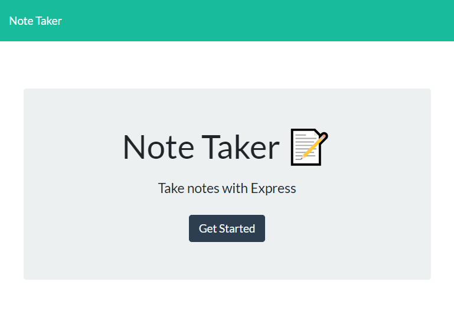
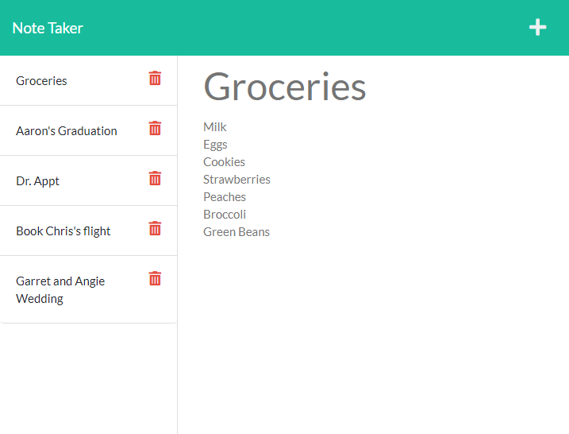

# Week11 Note Taker

## Description

- This is a server based app that allows one to view, create, and delete notes.
- All notes will be stored on a database that resides on a Heroku server.
- Existing notes can be viewed by clicking on the title in the left column.  The note will be displayed in the right column.
- Notes can be deleted by clicking on the trash icon.
- Notes can be added by selecting the '+' icon, and adding the title and note body, and then clicking the save icon.

## Usage

- Run application by vising [https://calm-tundra-14834.herokuapp.com/](https://calm-tundra-14834.herokuapp.com/)

## Screenprints 
 

---